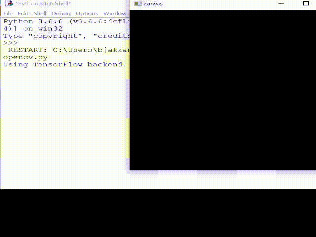

# DigitClassifier
Model is trained on keras to classify digits(0-9)
 
<ul>
  <li>DataSet: MNIST</li>
  <li>Language used: Python</li>
  <li>Machine Learning Library: TensorFlow (with Keras API)</li>
</ul>
 
It's a simple convolutional model built using Keras and trained on MNIST dataset.
  

